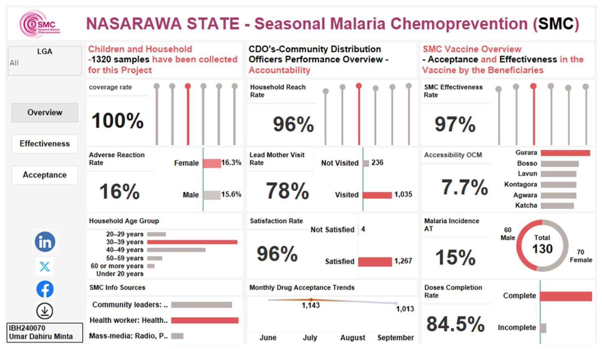
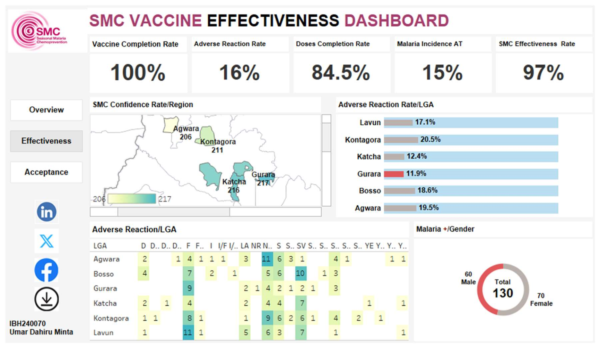
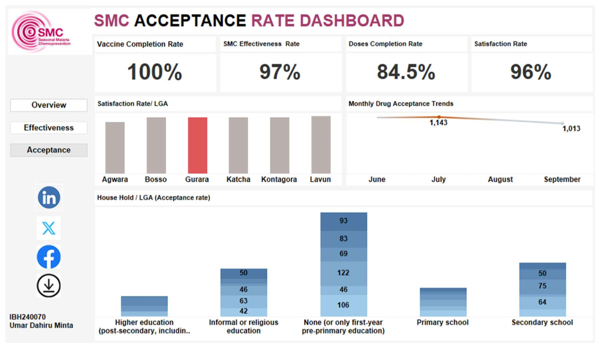

# Seasonal Malaria Chemoprevention (SMC) Project Performance Report 
 
- Prepared by: Umar Dahiru Minta 
- ID: IBH240070 
- Umardahiruminta997@gmail.com
- [Report Pdf]()

 
# Executive Summary 
This report presents the performance analysis of the Seasonal Malaria Chemoprevention (SMC) program using data collected from 1,320 children and households. The evaluation spans across key indicators including vaccine effectiveness, adverse reactions, program acceptance, and community reach. Results show excellent vaccine coverage and effectiveness, moderate adverse reaction rates, and high overall satisfaction among beneficiaries. 

## Objectives
- Assess the effectiveness of the SMC intervention
- Evaluate adverse reactions and safety outcomes
- Measure community acceptance and satisfaction
- Analyze program reach and accessibility
- Identify gaps and provide actionable recommendations

## SMC General Overview Dashboard
 

## SMC Vaccine Effectiveness Dashboard

## SMC Acceptance Rate Dashboard

## 1. SMC Vaccine Effectiveness 
Definitions: 
-	PPV (Proportion of Population Vaccinated With SMC): 90.2% 
-	PCV (Proportion of Cases Vaccinated With SMC): 9.8%

  
### Formula for Vaccine Effectiveness (VE): 
- VE = (PPV - PCV) / (PPV × (1 - PCV)) × 100 
- Substituting the given values: 
- VE = (0.902 - 0.098) / (0.902 × (1 - 0.098)) × 100 
- VE = 0.804 / (0.902 × 0.902) × 100 VE = 0.804 / 0.813604 × 100 ≈ 98.82% 
### Observation: 
the estimated effectiveness of the Seasonal Malaria Chemoprevention (SMC) vaccine is approximately 98.82%. This high level of effectiveness indicates a strong protective impact of the SMC intervention among the target population. 

## 2.	Key Performance Indicators (KPIs)  

- Vaccine Completion Rate 	100% 
- Doses Completion Rate 	84.5% 
- SMC Effectiveness Rate 	97% 
- Adverse Reaction Rate 	16% 
- Malaria Incidence Rate (AT) 	15% 
- Overall Satisfaction Rate 	96% 
- Household Reach Rate 	96%

 
## 3.	Adverse Reaction Analysis 
  
-	Overall Adverse Reaction Rate: 16%
-	 - By Gender: 
-	Female: 16.3%
- Male: 15.6% - By LGA: 
  
-	Highest in Kontagora (20.5%), Agwara (19.5%), and Bosso (18.6%) 
-	Lowest in Gurara (11.9%) and Katcha (12.4%) 
 
### Observation:
The data suggests that although the adverse reaction rate is within acceptable limits, targeted follow-ups in LGAs like Kontagora and Agwara may help improve outcomes further. 

## 4. Community Acceptance and Confidence 
 
-	Satisfaction Rate per LGA: Uniformly high across all LGAs, with Gurara leading. 
-	Drug Acceptance Trends: A decline observed from June (1,143) to September (1,013). 
-	Household Acceptance by Education Level: 
-	Highest in households with no or only pre-primary education. 
-	Moderate in primary and secondary school categories. 
-	Lower in households with higher education. 

## 5. Accessibility and Outreach 
  
-	Community Distribution Officers (CDOs): 132 officers, including data collectors and 12 supervisors. 
-	Lead Mother Visits:   - Visited: 1,035 
-	Not Visited: 236 
-	Accessibility Challenges (OCM): 7.7% reported difficulties accessing services. 

## 6. Demographics and Source of Information 
   
-	Age Group with Most Respondents: 30–39 years - Information Channels: 
-	Community leaders and health workers were the most effective sources which indicate that mass media is less effective since the target communities are fragile. Spend less in mass media and focus in the 2 effective way  which they are coast effective. 
 

## 7. Gender and Malaria Incidence 
   
-	Malaria Positive Cases: 130 
-	Female: 70
- Male: 60
  
- This suggests a slightly higher burden among females, although the difference is minimal. 

 
 ## Recommendations 
1.	Improve Dose Completion: Target the 15.5% of children who did not complete doses. 
2.	Address High Adverse Reaction LGAs: Monitor LGAs like Kontagora and Agwara.
3. Stabilize Acceptance Trends: Investigate drop in drug acceptance and improve community engagement. 
4.	Targeted Education Campaigns: Tailor messages for households with higher education. 
5.	Leverage Health Workers & Media: Expand use of trusted information channels. 

## Conclusion 
The SMC program has demonstrated strong effectiveness and acceptance, with full vaccine completion and a very high satisfaction rate. Minor concerns around dose completion and adverse reactions in specific LGAs provide opportunities for improvement. With datadriven adjustments and targeted community engagement, the program can achieve even greater impact. 
About: 
   
 

